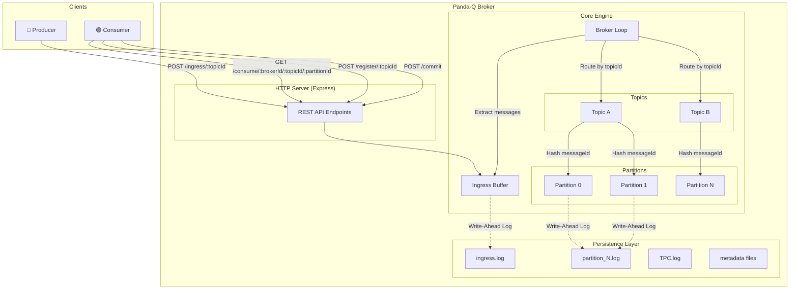
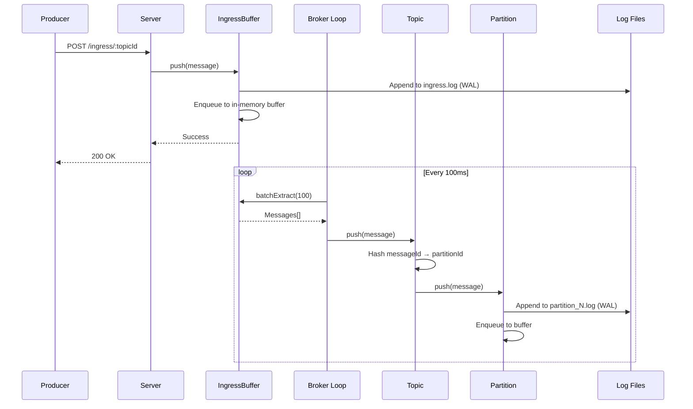
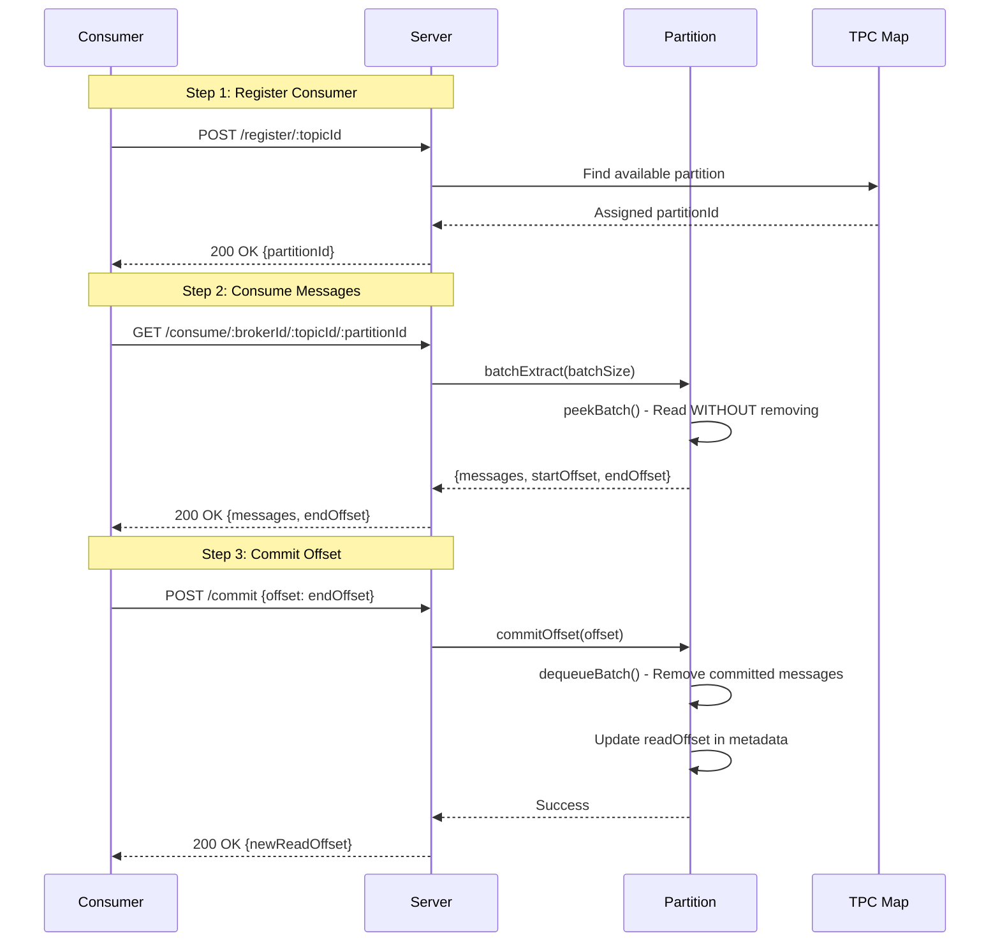
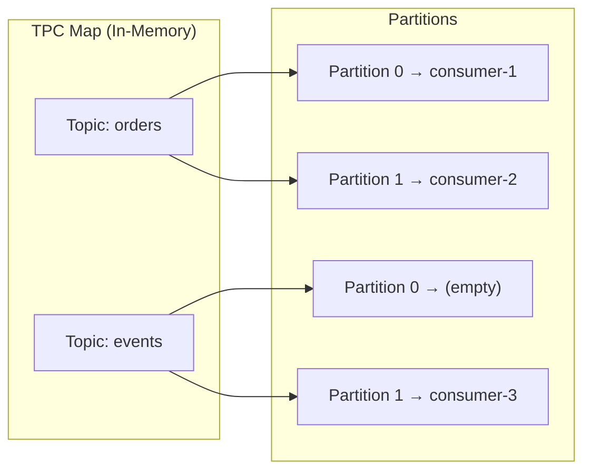

# Panda-Q Architecture

> **Panda-Q** is a single-node, performant & durable message broker with at-least-once delivery semantics.

---

## High-Level Architecture



---

## Data Flow

### Producer Flow (Message Ingestion)



### Consumer Flow (Message Consumption)



---

## Core Components

### Component Hierarchy

```
main.ts (Entry Point)
├── Bootstrap (Initialization)
│   ├── Parse mock-config.txt
│   ├── Initialize/Validate data directory
│   └── Populate TPC Map
├── Broker
│   ├── IngressBuffer (Staging area for incoming messages)
│   └── Topics Map<TopicId, Topic>
│       └── Topic
│           └── Partitions Map<PartitionId, Partition>
│               └── Partition (In-memory queue + persistence)
└── Server (HTTP API)
    ├── POST /register/:topicId
    ├── POST /ingress/:topicId
    ├── GET  /consume/:brokerId/:topicId/:partitionId
    └── POST /commit
```

### Key Classes

| Component | File | Responsibility |
|-----------|------|----------------|
| **Bootstrap** | `bootstrap.ts` | Parse config, initialize data directory, populate TPC Map |
| **Broker** | `broker.ts` | Main processing loop, route messages from ingress to partitions |
| **IngressBuffer** | `ingress-buffer.ts` | Staging area for producer messages before routing |
| **Topic** | `topic.ts` | Container for partitions, hash-based message routing |
| **Partition** | `partition.ts` | In-memory queue, WAL persistence, offset management |
| **Server** | `server.ts` | HTTP REST API endpoints |
| **Queue** | `shared/queue.ts` | Generic queue data structure with peek/dequeue |
| **LogFileHandler** | `shared/log-file-handler.ts` | Append-only log file operations |

---

## Offset Semantics

```
┌─────────────────────────────────────────────────────────────┐
│                     Partition Log File                      │
├─────┬─────┬─────┬─────┬─────┬─────┬─────┬─────┬─────┬───────┤
│  1  │  2  │  3  │  4  │  5  │  6  │  7  │  8  │  9  │  10   │
└─────┴─────┴─────┴─────┴─────┴─────┴─────┴─────┴─────┴───────┘
                    ▲                             ▲
                    │                             │
              readOffset=4                  logEndOffset=10
         (last message consumed)        (last message written)
```

| Offset | Definition |
|--------|------------|
| **logEndOffset** | Index of the last message **inserted** into the partition |
| **readOffset** | Index of the last message **extracted/committed** by consumer |

**Invariant**: `logEndOffset >= readOffset` (violated = invalid state)

---

## Persistence Layer

### File Structure

```
pandaq-data/
├── ingress.log                    # Write-ahead log for ingress buffer
├── ingress_metadata.log           # Ingress offset tracking: ingress|logEndOffset|readOffset
├── config.log                     # Topic configuration snapshot
├── TPC.log                        # Topic-Partition-Consumer mapping
└── topics/
    └── topic_{topicId}/
        ├── partition_0.log        # WAL for partition 0
        ├── partition_1.log        # WAL for partition 1
        └── {topicId}_partition_metadata.log  # Partition offsets
```

### Log File Formats

| File | Format |
|------|--------|
| **ingress.log** | `brokerId\|offset\|topicId\|messageId\|content` |
| **partition_N.log** | `topicId\|partitionId\|offset\|messageId\|content` |
| **TPC.log** | `topicId\|partitionId\|consumerId` |
| **ingress_metadata.log** | `ingress\|logEndOffset\|readOffset` |
| **partition_metadata.log** | `{topicId}_partition_{id}\|logEndOffset\|readOffset` |

---

## TPC Map (Topic-Partition-Consumer)

The TPC Map tracks which consumer is assigned to which partition.



**Persistence**: Serialized to `TPC.log` on every consumer registration/commit.

---

## Client SDK

### Producer

```typescript
const producer = new Producer("broker-1", "http://localhost:3000", "orders");

await producer.produce({
    messageId: "msg-001",
    content: { orderId: "123", amount: 99.99 }
});
```

### Consumer

```typescript
const consumer = new Consumer(
    "http://localhost:3000",
    "broker-1",
    "consumer-1",
    "orders"
);
// Auto-registers and gets assigned a partition

// Consume messages
const result = await consumer.batchConsume();
console.log(result.data.messages);
console.log(result.data.endOffset);  // Use this for commit

// Commit after processing
await consumer.commitOffset(result.data.endOffset);
```

---

## API Reference

| Endpoint | Method | Description |
|----------|--------|-------------|
| `/register/:topicId` | POST | Register consumer, get assigned partition |
| `/ingress/:topicId` | POST | Produce message to topic |
| `/consume/:brokerId/:topicId/:partitionId` | GET | Consume messages (add `?b=t` for batch) |
| `/commit` | POST | Commit offset after processing |
| `/stats` | GET | Get broker, topic, and partition statistics |

### Response Examples

**Stats Response:**
```json
{
    "success": true,
    "data": {
        "brokerId": "broker_1",
        "topicCount": 1,
        "topics": [
            {
                "topicId": "nasal",
                "partitionCount": 2,
                "partitions": [
                    {
                        "partitionId": 0,
                        "logEndOffset": 138,
                        "readOffset": 5,
                        "bufferSize": 133,
                        "pendingMessages": 133
                    },
                    {
                        "partitionId": 1,
                        "logEndOffset": 164,
                        "readOffset": 0,
                        "bufferSize": 164,
                        "pendingMessages": 164
                    }
                ]
            }
        ],
        "ingressBuffer": {
            "bufferSize": 0,
            "logEndOffset": 302,
            "readOffset": 302
        },
        "timestamp": "2026-02-09T16:51:49.847Z"
    }
}
```

**Consume Response:**
```json
{
    "success": true,
    "data": {
        "messages": [...],
        "count": 10,
        "startOffset": 5,
        "endOffset": 15
    }
}
```

**Commit Response:**
```json
{
    "success": true,
    "data": {
        "committed": true,
        "offset": 15,
        "logEndOffset": 100,
        "newReadOffset": 15
    }
}
```

---

## Crash Recovery

On restart, the broker recovers state from log files:

1. **Bootstrap** reads `TPC.log` → restores consumer assignments
2. **IngressBuffer** reads `ingress_metadata.log` → gets `readOffset`
3. **IngressBuffer** rebuilds queue from `ingress.log` starting at `readOffset`
4. **Each Partition** reads `partition_metadata.log` → gets `readOffset`
5. **Each Partition** rebuilds queue from `partition_N.log` starting at `readOffset`

Messages are never lost because they're persisted to log files **before** being acknowledged to producers.

---

## Configuration

### pandaq-config.json

```json
{
  "brokerId": "broker_1",
  "reboot": false,
  "topics": [
    { "id": "orders", "partitions": 3 },
    { "id": "events", "partitions": 2 }
  ]
}
```

| Field | Type | Description |
|-------|------|-------------|
| `brokerId` | string | Unique identifier for this broker |
| `reboot` | boolean | If `true`, deletes all data on startup (fresh start) |
| `topics` | array | List of topics with their partition count |

### Environment Variables (.env)

| Variable | Description |
|----------|-------------|
| `BROKER_ID` | Unique identifier for this broker |
| `DATA_STORAGE_VOLUME` | Base path for data files |
| `INGRESS_LOG_FILE` | Path to ingress write-ahead log |
| `PORT` | HTTP server port (default: 3000) |
